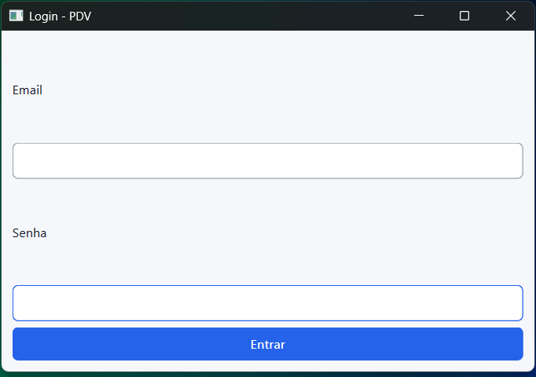
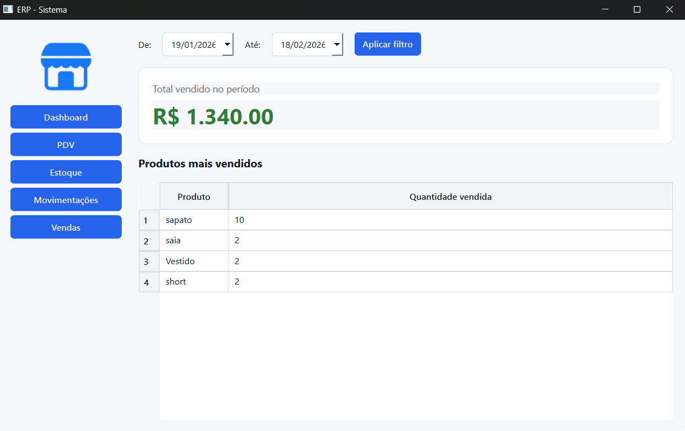
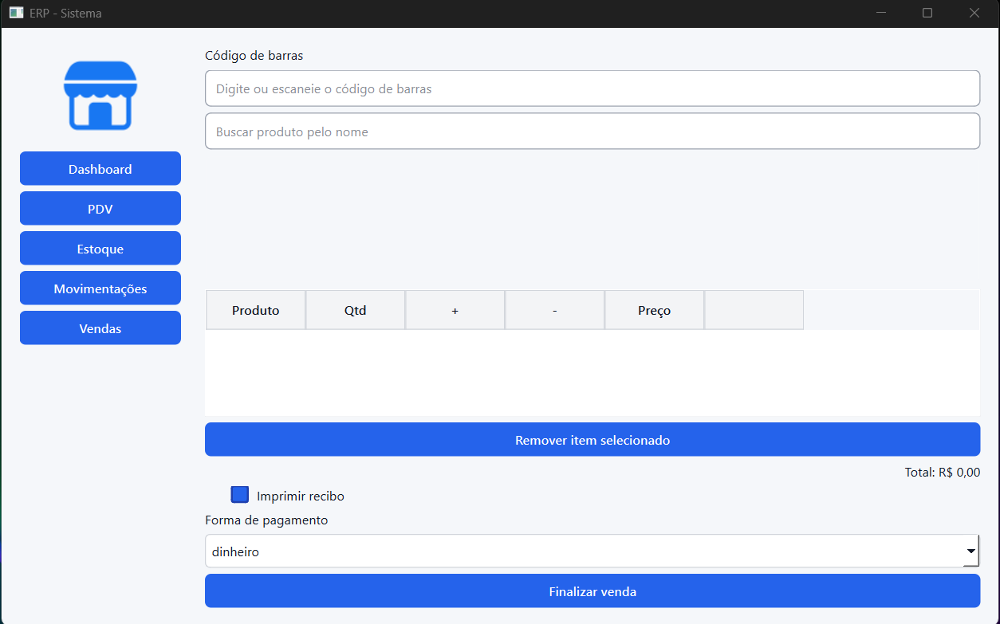
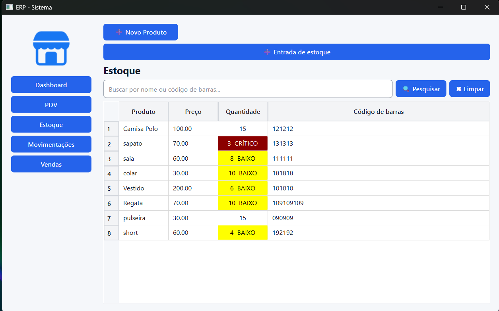
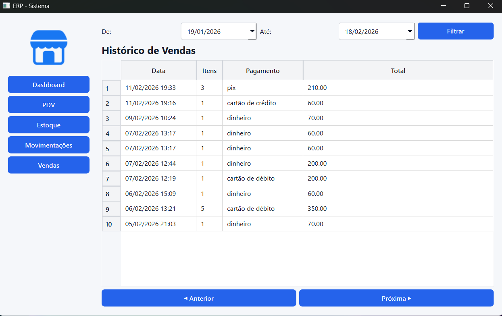

# ERP Desktop (Python)

Aplicação desktop para pequena loja: PDV, estoque, vendas e um dashboard local.

O frontend (PySide6) não acessa o banco. Ele fala com uma API FastAPI, que persiste em SQLite e isola os dados pela loja do usuário logado (`store_id`).

Repositório: [Miguel-Arantes2001/ERP_Desktop-Python](https://github.com/Miguel-Arantes2001/ERP_Desktop-Python)

## O que o sistema faz hoje

- **Login** com JWT (access token + refresh token). Senha com hash bcrypt.
- **Dashboard** com filtro de período, total vendido, quantidade de vendas, ticket médio, produto que mais faturou, gráfico de top produtos e vendas por forma de pagamento.
- **PDV** com código de barras, busca por nome, carrinho, unidades `un` / `kg` / `m`, conferência de estoque e impressão de cupom no Windows.
- **Venda rápida** (lançamento do caderno): descrição + valor, sem produto cadastrado e sem baixa de estoque.
- **Estoque**: cadastro, edição, código de barras, foto do produto (QR no celular), alerta de estoque baixo/crítico.
- **Movimentações** de entrada e saída.
- **Histórico de vendas** com filtro de data, paginação e detalhe dos itens.

## Arquitetura

```
erp-frontend (PySide6)
        │  HTTP + JWT
        ▼
erp-backend (FastAPI)
        │
        ▼
     SQLite (erp.db)
```

- Backend: regras de negócio, autenticação e persistência.
- Frontend: telas, carrinho e consumo da API em `services/`.
- Multi-loja: um banco só; cada registro carrega `store_id`. Não é um arquivo SQLite por loja.

## Estrutura

```
erp-backend/     API (rotas, models, auth, SQLite)
erp-frontend/    App desktop (views, services, QSS)
docs/            Notas internas do projeto
assets/          Screenshots
```

## Como rodar

Python 3.11+ e dois terminais.

### 1. Backend

```bash
cd erp-backend
python -m venv .venv
.venv\Scripts\activate
pip install -r requirements.txt
copy .env.example .env
```

Edite `.env` e coloque uma `SECRET_KEY` própria. Depois:

```bash
uvicorn main:app --reload --host 0.0.0.0 --port 8000
```

`--host 0.0.0.0` é necessário para o celular, na mesma Wi-Fi, abrir a página de foto.

### 2. Frontend

```bash
cd erp-frontend
python -m venv .venv
.venv\Scripts\activate
pip install -r requirements.txt
python main.py
```

A UI espera a API em `http://127.0.0.1:8000`.

## Stack

| Peça | Tecnologia |
|------|------------|
| API | FastAPI, SQLAlchemy, Pydantic |
| Banco | SQLite |
| Auth | JWT (`python-jose`) + bcrypt |
| Desktop | PySide6, requests |
| Foto | QR Code + upload pelo celular (Pillow) |
| Cupom | `pywin32` (Windows) |

## Screenshots

| Login | Dashboard |
| --- | --- |
|  |  |

| PDV | Estoque |
| --- | --- |
|  |  |

| Movimentações | Vendas |
| --- | --- |
|  |  |

## Segurança neste repositório

Não entram no Git:

- `.env` (chave JWT)
- `tokens.json` (sessão do operador)
- `erp.db` (dados da loja)
- `.venv/`
- fotos em `erp-backend/static/products/`

Use `.env.example` como modelo.

## Observações

Projeto de portfólio / estudo, com uso real em loja. Ainda é local: o backend precisa estar no ar na máquina. Impressão de cupom e `pywin32` são específicos de Windows.
