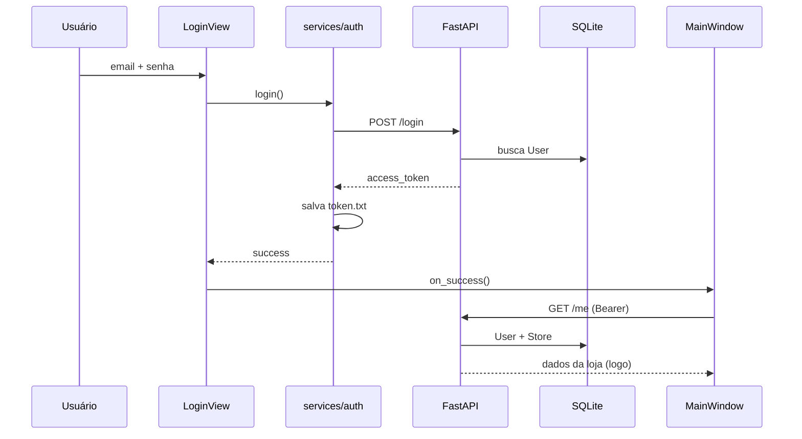
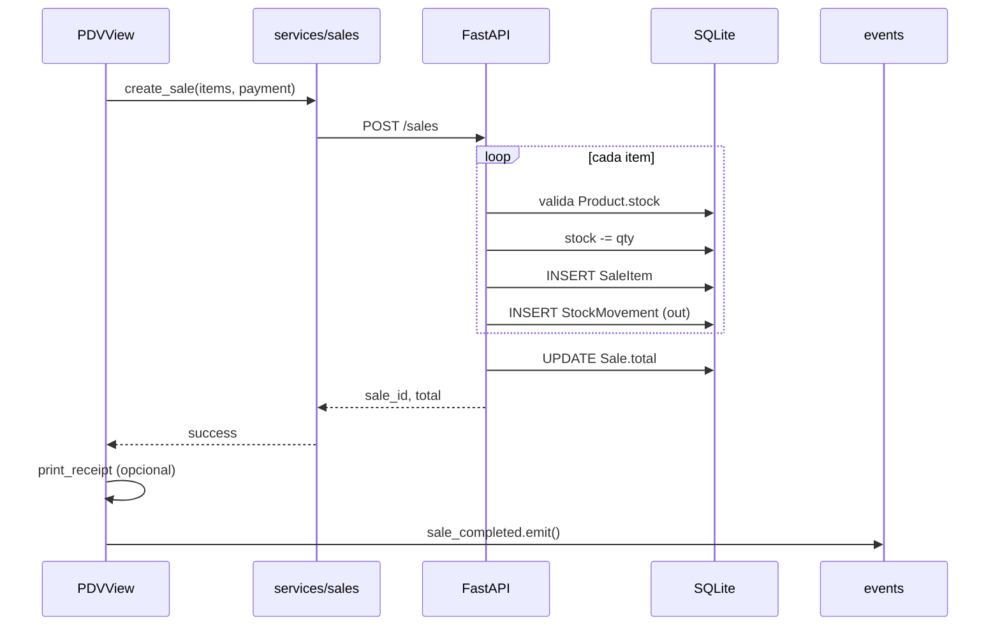

# Arquitetura — ERP

## Padrão arquitetural

O sistema segue uma arquitetura **cliente-servidor em camadas**:

```
┌─────────────────────────────────────────────────────────┐
│                    erp-frontend (Cliente)                │
│  ┌──────────┐  ┌──────────┐  ┌──────────────────────┐ │
│  │  Views   │→ │ Services │→ │  api.py (HTTP client) │ │
│  │ (PySide6)│  │ (domínio)│  └──────────┬───────────┘ │
│  └──────────┘  └──────────┘             │             │
└───────────────────────────────────────────┼─────────────┘
                                            │ REST / JSON
                                            │ Bearer JWT
┌───────────────────────────────────────────▼─────────────┐
│                    erp-backend (Servidor)                  │
│  ┌──────────┐  ┌──────────┐  ┌──────────┐  ┌─────────┐ │
│  │ main.py  │→ │ models   │→ │ database │→ │ SQLite  │ │
│  │(routers) │  │(SQLAlch.)│  │(session) │  │ erp.db  │ │
│  └────┬─────┘  └──────────┘  └──────────┘  └─────────┘ │
│       │                                                    │
│  ┌────▼─────┐  ┌──────────┐                               │
│  │ auth.py  │  │ schemas  │                               │
│  │(JWT/bcrypt)│ │(Pydantic)│                               │
│  └──────────┘  └──────────┘                               │
└───────────────────────────────────────────────────────────┘
```

**Separação de responsabilidades:**

- **Views** — apenas UI e interação do usuário
- **Services (frontend)** — chamadas HTTP organizadas por domínio
- **main.py (backend)** — orquestra regras de negócio e HTTP
- **models.py** — persistência e relacionamentos
- **schemas.py** — contrato da API (entrada/saída)
- **auth.py** — segurança transversal (middleware via `Depends`)

---

## Backend (`erp-backend`)

### Camadas

| Arquivo | Responsabilidade |
|---------|------------------|
| `database.py` | Engine SQLite, `SessionLocal`, dependency `get_db()` |
| `models.py` | Tabelas e relacionamentos ORM |
| `schemas.py` | DTOs Pydantic (`ProductCreate`, `SaleCreate`, etc.) |
| `auth.py` | Hash bcrypt, JWT, `get_current_user` |
| `main.py` | Todos os endpoints FastAPI |

### Inicialização

Em `main.py`:

```python
models.Base.metadata.create_all(bind=engine)
```

Isso cria as tabelas automaticamente se não existirem (sem migrations formais).

### Multi-tenancy (isolamento por loja)

Quase todos os endpoints protegidos usam:

```python
current_user: models.User = Depends(get_current_user)
```

E filtram por `current_user.store_id`:

- Produtos pertencem à loja
- Vendas são criadas com `store_id` do usuário
- Relatórios agregam apenas vendas da loja
- Movimentações são filtradas via `JOIN` com `Product.store_id`

Isso garante que **Loja A nunca vê dados da Loja B**.

### Autenticação

1. `POST /register` — cria `Store` + `User` (senha com bcrypt)
2. `POST /login` — retorna JWT com `sub` (user id) e `store_id`
3. Endpoints protegidos exigem header `Authorization: Bearer <token>`
4. `get_current_user` decodifica JWT e carrega usuário do banco

Endpoints **públicos:** `/register`, `/login`  
Endpoints **protegidos:** demais rotas

### Regras de negócio importantes

**Criação de produto (`POST /products`):**
- Associa `store_id` do usuário
- Se `stock > 0`, registra movimentação inicial (`type=in`, motivo "Estoque inicial")

**Venda (`POST /sales`):**
- Para cada item: valida produto, valida estoque, decrementa `product.stock`
- Cria `SaleItem` com preço **no momento da venda** (snapshot)
- Registra `StockMovement` (`type=out`, motivo `Venda #<id>`)
- Calcula e persiste `total`

**Entrada de estoque (`POST /products/{id}/add-stock`):**
- Incrementa estoque e registra movimentação `in`

---

## Frontend (`erp-frontend`)

### Padrão MVCS simplificado

| Camada | Pasta | Função |
|--------|-------|--------|
| **View** | `views/` | Widgets Qt, tabelas, formulários |
| **Service** | `services/` | Funções que chamam a API |
| **Client HTTP** | `services/api.py` | Token, headers, tratamento de erro |
| **Widget** | `widgets/` | Sidebar de navegação |
| **Util** | `utils/` | Impressora, sessão (parcial) |

### Navegação

`MainWindow` usa `QStackedWidget`:

- Um widget por tela (Dashboard, PDV, Estoque, Movimentações, Vendas)
- `Sidebar` troca a página visível
- Ao mudar de página, chama `load_data()` se a view implementar

### Comunicação entre telas

`events.py` define um singleton `AppEvents` com sinal Qt:

```python
events.sale_completed = Signal()
```

Quando o PDV finaliza uma venda, emite o sinal; `SalesView` escuta e recarrega a lista.

### Persistência de sessão

Após login, o token JWT é salvo em `erp-frontend/token.txt`.  
`api_request()` lê esse arquivo e injeta o header em cada requisição.

Em resposta `401`, limpa o token e exibe aviso de sessão expirada.

### Estilização

`styles/erp.qss` — folha de estilo Qt aplicada globalmente em `main.py`.

---

## API — mapa de endpoints

| Método | Rota | Descrição |
|--------|------|-----------|
| POST | `/register` | Cadastro loja + usuário |
| POST | `/login` | Autenticação (OAuth2 form) |
| GET | `/me` | Dados do usuário e loja |
| GET/POST | `/products` | Listar / criar produtos |
| POST | `/products/{id}/add-stock` | Entrada de estoque |
| GET | `/products/barcode/{barcode}` | Busca por código de barras |
| POST | `/sales` | Registrar venda |
| GET | `/sales` | Listar vendas (paginação + filtro data) |
| GET | `/sales/{id}` | Detalhe de venda |
| GET | `/stock-movements` | Histórico de movimentações |
| GET | `/reports/sales/summary` | Total vendido no período |
| GET | `/reports/products/top` | Produtos mais vendidos |
| GET | `/reports/sales/by-payment` | Vendas por forma de pagamento |

Documentação interativa: `http://127.0.0.1:8000/docs` (Swagger do FastAPI).

---

## Modelo de dados (relacionamentos)

```
Store ──┬── User (1:N)
        ├── Product (1:N)
        └── Sale (1:N)

Sale ──── SaleItem (1:N) ──── Product

Product ── StockMovement (1:N)
```

---

## Diagrama de sequência — Login + listagem



---

## Diagrama de sequência — Venda no PDV



---

## Decisões arquiteturais

| Decisão | Motivo | Trade-off |
|---------|--------|-----------|
| SQLite | Simplicidade para aprendizado/portfólio | Não escala para múltiplos clientes simultâneos pesados |
| FastAPI + PySide6 | API reutilizável + UI nativa desktop | Dois processos para rodar |
| JWT stateless | Simples de implementar | Revogação de token é difícil |
| Regras no `main.py` | Projeto pequeno, tudo visível | Cresce, convém extrair para `routers/` e `services/` |
| Token em arquivo | Persistência simples entre sessões | Menos seguro que keyring/OS vault |
